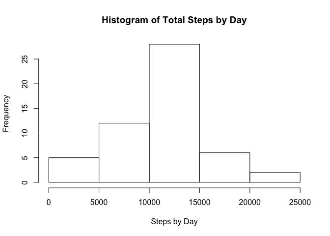
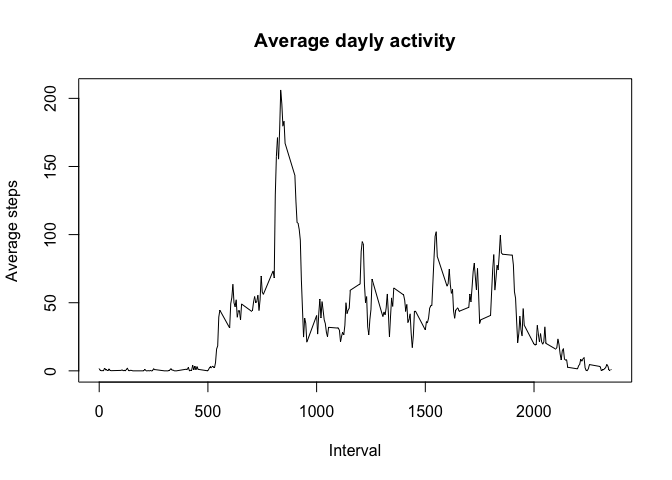

# Reproducible Research: Peer Assessment 1


## Loading and preprocessing the data
1. Load the data (i.e. `read.csv()`)

```r
unzip("activity.zip", exdir = "./data")
data <- read.csv("./data/activity.csv", sep=",", na.strings = "NA")
```
2. Process/transform the data (if necessary) into a format suitable for your analysis

```r
# Convert the column date to a date format
data$date <- as.Date(as.character(data$date), "%Y-%m-%d")
```

## What is mean total number of steps taken per day?
For this part of the assignment, you can ignore the missing values in the dataset.  
1. Make a histogram of the total number of steps taken each day

```r
tot.steps.day <- tapply(data$steps, data$date, sum)
hist(tot.steps.day, main = "Histogram of Total Steps by Day", xlab = "Steps by Day")
```

 

2. Calculate and report the **mean** and **median** total number of steps taken per day

```r
mean(tot.steps.day, na.rm = TRUE)
```

```
## [1] 10766.19
```

```r
median(tot.steps.day,na.rm = TRUE)
```

```
## [1] 10765
```

## What is the average daily activity pattern?
1. Make a time series plot (i.e. `type = "l"`) of the 5-minute interval (x-axis) and the average number of steps taken, averaged across all days (y-axis)

```r
# Load needed library
library(dplyr)
```

```
## 
## Attaching package: 'dplyr'
## 
## The following object is masked from 'package:stats':
## 
##     filter
## 
## The following objects are masked from 'package:base':
## 
##     intersect, setdiff, setequal, union
```

```r
data_tbl <- tbl_df(data)
avg.steps.by.interval <- 
        data_tbl %>%
        group_by(interval) %>%
        summarize(avg_steps = mean(steps, na.rm = TRUE))

plot(avg.steps.by.interval, type="l", main = "Average dayly activity", xlab = "Interval", ylab = "Average steps")
```

 

2. Which 5-minute interval, on average across all the days in the dataset, contains the maximum number of steps?

```r
max.steps <- max(avg.steps.by.interval$avg_steps)
filter.max.steps <- filter(avg.steps.by.interval, avg_steps == max.steps)
interval.with.max.steps <- filter.max.steps$interval
interval.with.max.steps
```

```
## [1] 835
```
The above calculation shows that interval `835` contains the maximun number of steps (206 steps)

## Imputing missing values


## Are there differences in activity patterns between weekdays and weekends?
