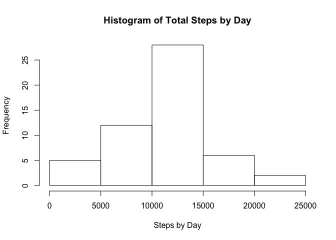
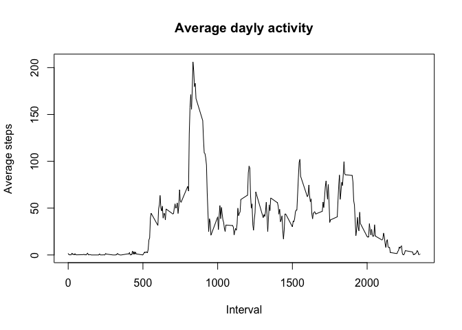
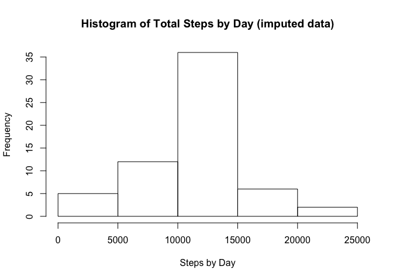

# Reproducible Research: Peer Assessment 1


## Loading and preprocessing the data
*1 Load the data (i.e. `read.csv()`)*

```r
unzip("activity.zip", exdir = "./data")
data <- read.csv("./data/activity.csv", sep=",", na.strings = "NA")
```
*2 Process/transform the data (if necessary) into a format suitable for your analysis*

```r
# Convert the column date to a date format
data$date <- as.Date(as.character(data$date), "%Y-%m-%d")
```

## What is mean total number of steps taken per day?
For this part of the assignment, you can ignore the missing values in the dataset.  
*1 Make a histogram of the total number of steps taken each day.*

```r
tot.steps.day <- tapply(data$steps, data$date, sum)
hist(tot.steps.day, main = "Histogram of Total Steps by Day", xlab = "Steps by Day")
```

 

*2 Calculate and report the **mean** and **median** total number of steps taken per day.*

```r
mean(tot.steps.day, na.rm = TRUE)
```

```
## [1] 10766.19
```

```r
median(tot.steps.day,na.rm = TRUE)
```

```
## [1] 10765
```

## What is the average daily activity pattern?
*1 Make a time series plot (i.e. `type = "l"`) of the 5-minute interval (x-axis) and the average number of steps taken, averaged across all days (y-axis)*

```r
# Load needed library
library(dplyr)
```

```
## Warning: package 'dplyr' was built under R version 3.1.2
```

```
## 
## Attaching package: 'dplyr'
## 
## The following object is masked from 'package:stats':
## 
##     filter
## 
## The following objects are masked from 'package:base':
## 
##     intersect, setdiff, setequal, union
```

```r
data_tbl <- tbl_df(data)
avg.steps.by.interval <- 
        data_tbl %>%
        group_by(interval) %>%
        summarize(avg_steps = mean(steps, na.rm = TRUE))

plot(avg.steps.by.interval, type="l", main = "Average dayly activity", xlab = "Interval", ylab = "Average steps")
```

 

*2 Which 5-minute interval, on average across all the days in the dataset, contains the maximum number of steps?*

```r
max.steps <- max(avg.steps.by.interval$avg_steps)
filter.max.steps <- filter(avg.steps.by.interval, avg_steps == max.steps)
interval.with.max.steps <- filter.max.steps$interval
interval.with.max.steps
```

```
## [1] 835
```
The above calculation shows that interval `835` contains the maximun number of steps (206 steps)

## Imputing missing values
Note that there are a number of days/intervals where there are missing values (coded as `NA`). The presence of missing days may introduce bias into some calculations or summaries of the data.

*1 Calculate and report the total number of missing values in the dataset (i.e. the total number of rows with `NA`s)*

```r
totalNA <- sum(is.na(data$steps))
```
Total missing values in dataset: `2304`

*2 Devise a strategy for filling in all of the missing values in the dataset. The strategy does not need to be sophisticated. For example, you could use the mean/median for that day, or the mean for that 5-minute interval, etc.*

I choose to replace any missing value `NA` with the mean for that 5-minute interval. 
The means have already been calculated and assigned to `avg.steps.by.interval`.
I then use the **left_join** from `dplyr` to merge the original dataset with `avg.steps.by.interval` and replace any `NA` with the conresponding value in avg_steps.

*3 Create a new dataset that is equal to the original dataset but with the missing data filled in.*  
Implementation of the above strategy

```r
imputedData <- data %>%
        left_join(avg.steps.by.interval, by = "interval") %>%
        mutate(steps = ifelse(is.na(steps), round(avg_steps), steps))
```

*4 Make a histogram of the total number of steps taken each day and Calculate and report the **mean** and **median** total number of steps taken per day. Do these values differ from the estimates from the first part of the assignment? What is the impact of imputing missing data on the estimates of the total daily number of steps?*

```r
tot.steps.day.imputed <- tapply(imputedData$steps, imputedData$date, sum)
hist(tot.steps.day.imputed, main = "Histogram of Total Steps by Day (imputed data)", xlab = "Steps by Day")
```

 


```r
mean(tot.steps.day.imputed, na.rm = TRUE)
```

```
## [1] 10765.64
```

```r
median(tot.steps.day.imputed, na.rm = TRUE)
```

```
## [1] 10762
```

The imputed missing data has almost no impact on the mean and the median. The histogram shows a higher frequency for the steps between 10000 and 15000.

## Are there differences in activity patterns between weekdays and weekends?
